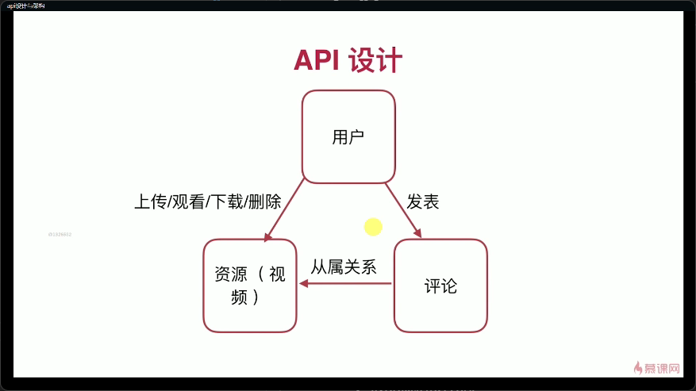

# 后端

## API

- restful api
- 使用http， 使用json

### 特点

- 统一接口
- 无状态
- 可缓存
- 分层
- cs模式

### 设计原则

- 以url风格设计api
- 通过不同的method区分对于资源的crud
- 返回码符合http资源描述的规定

### api设计

#### 用户api

| URL | Method | Description | Code |
| -- | -- | -- | -- |
| /user | post | 创建用户 | 201, 400, 500 |
| /user/:username | post | 登录 | 200,400,500 | 
| /user/:username | get | 获取用户信息 | 200, 400, 401, 403, 500 |
| /user/:username | delete | 用户注销 | 204, 400, 401, 403, 500 |
